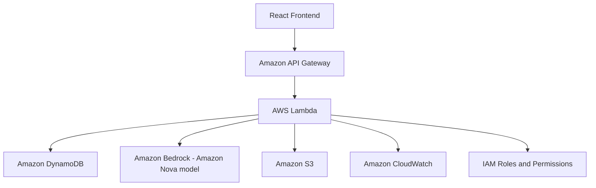

# FitRight AI

FitRight AI is an AI-powered fashion sizing and return-intelligence application designed to reduce apparel returns caused by incorrect sizing. It has two connected experiences: a customer flow that turns body measurements into an explainable size recommendation, and a seller flow that turns return signals into readable sizing insights.

> **Current environment status:** the application runs in **Demo Mode** because AWS resources are not configured in this preview. Demo data is explicitly labelled. The live AWS path is implemented server-side and becomes active when the required environment variables, IAM role, DynamoDB tables, S3 bucket, and Bedrock model access are configured.

## Problem statement

Customers often choose a size with incomplete information. Sellers then receive returns that contain valuable fit signals but are difficult to aggregate and interpret. FitRight keeps the size decision deterministic and explainable while using generative AI for language and pattern interpretation.

## Solution

FitRight compares customer measurements with a product's size chart, applies fit-preference and usual-size signals, and selects the size with the lowest reasonable mismatch. The application-generated Fit Match Score communicates match quality; it is not a medical, scientific, or probabilistic claim. Amazon Bedrock is used only to explain the fixed recommendation, classify return feedback, and generate seller-facing summaries.

## Features

- Responsive premium fashion storefront with curated product cards and product detail pages.
- Visible size charts with chest, waist, and garment length ranges.
- Find My Fit form with validation, measurement guidance, fit preference, and product selection.
- Deterministic backend size recommendation with match score, confidence label, measurement differences, alternatives, and fit tip.
- Return feedback form that stores raw feedback and creates a structured classification.
- Seller dashboard with demo-labelled summary cards, trend bars, reason mix, body-area distribution, product-level table, and AI insight panel.
- Cloud Architecture page explaining the frontend, API Gateway, Lambda, Bedrock, DynamoDB, S3, IAM, and CloudWatch roles.
- REST endpoints and typed tRPC procedures for the same feature set.
- Optional live Bedrock path through the server-only AWS SDK. No AWS credentials are placed in frontend code.

## AWS services and integration status

| Service | Intended responsibility | Code path | Demo status |
| --- | --- | --- | --- |
| Amazon Bedrock | Explain deterministic recommendations, classify return comments, generate seller insight | `server/fitright.ts` via `BedrockRuntimeClient` and `ConverseCommand` | Safe mock/fallback text until configured |
| AWS Lambda | Host backend handlers in a deployed AWS architecture | REST handler functions are isolated and deployment-ready | The local preview runs Express; deploy handlers behind Lambda/API Gateway |
| Amazon API Gateway | Expose secure REST APIs | REST routes under `/api/*` are documented and mounted in Express | Local server exposes equivalent paths |
| Amazon DynamoDB | Persist products, size charts, recommendations, returns, and insights | `PutItemCommand` is used for live recommendation and return writes | In-memory seed data when `DEMO_MODE=true` |
| Amazon S3 | Store product imagery and static assets | `image_url` supports S3 URLs; the full-stack scaffold includes storage helpers | Preview uses curated remote demo imagery |
| AWS IAM | Least-privilege role for Lambda access | Documented in deployment section; credentials remain server-side | Not configured in preview |
| Amazon CloudWatch | Safe application logging and operational visibility | Server logs avoid measurement payloads beyond the request lifecycle | Local logs in development |

### Architecture diagram



## Local setup

This repository is a Vite + React 19 + Tailwind 4 frontend with an Express + tRPC backend and Drizzle-ready database scaffold.

```bash
pnpm install
pnpm dev
```

Open the local preview URL printed by the dev server. The default is port `3000` when available.

The web app is intentionally usable without AWS credentials. Keep `DEMO_MODE=true` for local development until cloud resources are ready.

## Environment variables

Do not put AWS credentials in any `VITE_` variable or frontend file. In a deployed environment, prefer the Lambda execution role over access keys.

```bash
# frontend-safe
VITE_DEMO_MODE=true
VITE_API_BASE_URL=

# server-only
DEMO_MODE=true
AWS_REGION=ap-south-1
BEDROCK_MODEL_ID=amazon.nova-lite-v1:0
DYNAMODB_PRODUCTS_TABLE=fitright-products
DYNAMODB_SIZE_CHART_TABLE=fitright-size-charts
DYNAMODB_RECOMMENDATIONS_TABLE=fitright-recommendations
DYNAMODB_RETURNS_TABLE=fitright-returns
DYNAMODB_INSIGHTS_TABLE=fitright-insights
S3_BUCKET_NAME=fitright-assets
```

Amazon Nova 2 Lite should be selected when it is available in the target region and account. If it is not available, configure a currently enabled Amazon Nova model supported by the account. The code reads `BEDROCK_MODEL_ID` instead of hardcoding a model decision into the frontend.

A copyable template is also included at `docs/env.example`. The managed project environment prevents writing secrets into a root `.env.example` file from the editor; copy the documented values into your local secret manager or deployment configuration instead.

## API endpoints

All responses use `{ "success": true, "data": ... }` on success and `{ "success": false, "error": "..." }` on validation failure.

| Method | Path | Purpose |
| --- | --- | --- |
| `GET` | `/api/health` | Report demo/live mode and timestamp |
| `GET` | `/api/products` | List product data and size charts |
| `GET` | `/api/products/{product_id}` | Read a product |
| `POST` | `/api/recommend-size` | Validate measurements and create a deterministic recommendation |
| `POST` | `/api/return-feedback` | Save feedback and classify the comment |
| `GET` | `/api/seller/dashboard` | Read aggregated seller analytics |
| `POST` | `/api/seller/ai-insight` | Generate a Bedrock seller insight or safe Demo Mode fallback |

The frontend uses typed tRPC equivalents under `/api/trpc/fitright.*` to preserve end-to-end types. REST aliases are mounted in `server/fitright-rest.ts` for API Gateway/Lambda deployment.

### Example recommendation payload

```json
{
  "productId": "prod_001",
  "heightCm": 175,
  "chestIn": 39,
  "waistIn": 33,
  "usualSize": "M",
  "preferredFit": "regular"
}
```

The backend reads the product chart first, computes mismatch distance for every available size, adjusts for preference compatibility and usual-size consistency, and only then asks Bedrock for explanation text. Bedrock is not allowed to override the selected size.

## Data models and seed data

`server/fitright.ts` contains DynamoDB-compatible sample records for:

- Product and size chart data.
- Customer recommendation records.
- Return feedback and structured AI classification.
- Seller dashboard aggregates and insight payloads.

`seed-data.json` contains compact payload examples for local/API testing. For production, create separate DynamoDB tables or a single-table design with explicit partition-key conventions and least-privilege access.

## AWS deployment outline

1. Create DynamoDB tables for products, size charts, recommendations, returns, and insights. Seed product and size-chart records using the shape in `server/fitright.ts`.
2. Create an S3 bucket for product images and static assets. Keep the bucket private where possible and serve images with controlled URLs.
3. Enable the selected Amazon Nova model in Amazon Bedrock for the deployment region. Start with `amazon.nova-lite-v1:0` or the current Nova model approved in the account.
4. Create a Lambda execution role with only the required permissions: `bedrock:Converse`, read/write access to the named DynamoDB tables, read access to the S3 bucket, and CloudWatch log writes.
5. Deploy the REST handlers from `server/fitright-rest.ts` behind API Gateway. Add request validation, throttling, access logging, and CORS rules for the deployed frontend origin.
6. Set `DEMO_MODE=false`, `AWS_REGION`, `BEDROCK_MODEL_ID`, table names, and bucket name in the server/Lambda environment. Do not set AWS secrets in frontend build variables.
7. Set `VITE_API_BASE_URL` to the API Gateway base URL and deploy the React build to the chosen static host.
8. Run the demo flow: browse a product, submit measurements, inspect the recommendation, submit feedback, open seller analytics, and refresh the insight.

### Suggested IAM policy boundaries

- `bedrock:Converse` limited to the configured Nova model ARN where supported.
- `dynamodb:GetItem`, `dynamodb:Query`, `dynamodb:PutItem`, and `dynamodb:UpdateItem` limited to the named FitRight tables.
- `s3:GetObject` limited to the product asset prefix; upload permissions isolated to an admin/seed workflow.
- `logs:CreateLogGroup`, `logs:CreateLogStream`, and `logs:PutLogEvents` limited to the Lambda log group.

## Security notes

- AWS SDK code runs only in the server layer.
- Do not log raw measurements, credentials, access tokens, or unnecessary free-text personally identifying information.
- Validate numeric ranges and free-text length before calling Bedrock or DynamoDB.
- Strip code fences and validate Bedrock JSON before storing a classification. Invalid JSON uses the safe `other` fallback.
- Use API Gateway throttling and authentication appropriate to the seller environment.
- Use IAM roles rather than long-lived keys, rotate any temporary local credentials, and keep production tables and buckets separate from demo data.
- The dashboard is not connected to Amazon marketplace data in Demo Mode; its numbers are labelled demo data.

## Demo flow

1. Open the landing page and use **Explore products** or **Try find my fit**.
2. Open a product to view the image, material, available sizes, and size chart.
3. Submit measurements in **Find my fit**. The backend calculates the selected size and the UI shows the application-generated match score.
4. Review the explanation, measurement comparison, alternatives, and fit tip.
5. Submit a return comment in **Returns** and receive a confirmation. Demo Mode uses a safe local classification fallback.
6. Open **Seller dashboard**. Review demo-labelled summary cards, charts, product table, and the Bedrock Seller Insights panel.
7. Open **Cloud Architecture** to explain the live AWS path and Demo Mode boundary.

## Known limitations

- The preview is Demo Mode until AWS resources are configured; it does not claim live Bedrock, DynamoDB, S3, or marketplace data.
- The local backend uses in-memory demo product and analytics data. Live writes are implemented for recommendation and return records when the corresponding DynamoDB table names are configured.
- A production deployment should split the Express REST handlers into Lambda entry points or use an adapter, then put API Gateway authentication and throttling in front.
- The UI does not process refunds or approve returns.
- The Fit Match Score is a product-matching heuristic and should not be presented as a scientific probability.

## Project structure

```text
client/src/pages/Home.tsx       Customer storefront, fit, returns, seller, architecture views
client/src/index.css            Global visual system and responsive styles
server/fitright.ts              Demo data, deterministic sizing, Bedrock/DynamoDB path
server/fitright-rest.ts         REST endpoint aliases for API Gateway deployment
server/routers.ts               Typed tRPC procedures used by the frontend
seed-data.json                  Compact seed examples
docs/env.example                Environment variable template
```
